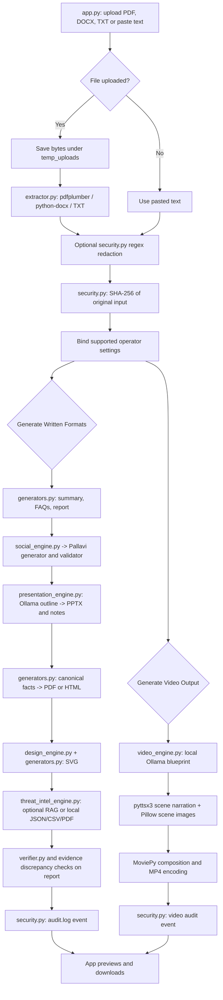

# SIH PS 26154 — Technical Approach and System Architecture

This specification describes the implementation currently wired through `my_code/app.py` and its imported modules. It does not describe planned enterprise components. File paths below are relative to the repository unless otherwise stated.

## 1. Implemented Technology Stack

| Architecture layer | Component / module | Tools and libraries used | Implemented concepts |
|---|---|---|---|
| **Layer 1: Input ingestion** | `my_code/app.py`; `my_code/modules/extractor.py` | Streamlit upload/text input, Python file I/O, `pdfplumber`, `python-docx` | PDF, DOCX, TXT, and pasted-text intake; extension-based extraction; page text joined into a string; DOCX paragraphs and tables joined into a string |
| **Layer 2: Privacy and integrity** | `my_code/app.py`; `my_code/modules/security.py` | `re`, `hashlib`, `loguru` | Optional regex redaction for email and selected credential patterns; SHA-256 of original uploaded bytes or raw pasted text; local formatted audit log messages |
| **Layer 3: Design and context inference** | `my_code/modules/design_engine.py` | Python dictionaries, string/keyword matching, regex for topic text | Rule-based selection of built-in theme palette, severity color, layout intent, icon/motif, typography, and spacing from supplied fact fields |
| **Layer 4: Local model calls and orchestration** | `my_code/app.py`; `my_code/modules/generators.py`; `my_code/modules/presentation_engine.py`; `my_code/modules/video_engine.py`; `pallavi_code/generator.py` through `social_engine.py` | Python `ollama` client; `requests` to local Ollama HTTP API | Prompt-based summary, FAQ, report, fact extraction, slide outline, social content, and video blueprint generation. Defaults commonly use `qwen2.5:3b`; the social adapter uses Pallavi generator settings/model defaults. |
| **Layer 5: Output synthesis** | `generators.py`, `social_engine.py`, `presentation_engine.py`, `video_engine.py` | `python-pptx`, Pillow, MoviePy, `pyttsx3`, optional WeasyPrint, Python string/HTML/SVG generation | Text output, HTML/PDF advisory, manually constructed SVG, PPTX slide layouts and notes, Pillow scene images, local narration WAV files, and MP4 composition |
| **Layer 6: Threat evidence and verification** | `my_code/modules/threat_intel_engine.py`; `my_code/modules/verifier.py`; Pallavi validator through `social_engine.py` | Optional SQLAlchemy-based Ishita RAG backend; JSON/CSV/PDF readers; `pdfplumber`; regex and string matching | Local evidence lookup with bundled-file fallback; exact indicator presence checks; report-versus-source/evidence discrepancy reporting; separate validation of social content |

### Implemented scope notes

- PDF text extraction uses `pdfplumber`, not PyMuPDF/`fitz`.
- SVG markup is constructed directly in `generators.py`; the implementation does not use `svgwrite`.
- Audit messages are written to `data/outputs/audit.log`; the active code does not write `audit_log.json`, use a relational audit database, or create an append-only hash chain.
- Local Ollama endpoints are configured in the code. The code configuration alone does not prove network isolation or zero egress.
- Generation is sequential through the current Streamlit script, not concurrent worker execution.
- Verification checks selected indicators. It is not a semantic truth assessment or a guarantee of zero hallucinations.

## 2. Layer-by-Layer Processing Flow

### Layer 1 — Input ingestion and extraction

1. `app.py` displays an upload widget for `.pdf`, `.docx`, and `.txt`, plus a text area for pasted content.
2. An uploaded file is written to `temp_uploads/<uploaded-name>` using the current working directory as the path base.
3. `extract_raw_text()` dispatches by extension:
   - TXT: reads the file as UTF-8.
   - PDF: extracts non-empty page text with `pdfplumber` and joins pages with newlines.
   - DOCX: joins paragraph text and table-cell text with newlines.
4. Pasted text bypasses the extractor. Both inputs become the `raw_text` string used by subsequent steps.

The extractor does not return page/section metadata, normalize content beyond joining extracted pieces, or impose a payload-size/schema limit. `lock_deterministic_parameters()` separately identifies CVE patterns, IPv4-looking strings, severity terms, and character count.

### Layer 2 — Optional redaction and source checksum

1. If the redaction toggle is on, `app.py` passes extracted/pasted text to `redact_sensitive_pii()`.
2. `security.py` replaces email addresses and credential values matching its API-key, secret-key, and auth-token regex patterns. The function returns redacted text and counts. It does not cover every form of PII or every secret format.
3. If redaction fails, the app warns and continues with the original input text.
4. `compute_sha256()` hashes the uploaded file bytes or, for pasted input, the raw text string. The digest is computed from the original source, before redaction.

### Layer 3 — Fact-driven design inference

`design_engine.infer_design()` is called by visual generators with canonical facts or video/presentation context. It uses keyword checks to select among built-in `cyber`, `finance`, `technical`, and `general` palettes; it also selects a layout intent, severity color, icon/motif, and fixed typography and spacing values. The theme inference is internal Python logic, not an Ollama call and not a direct full-document classifier.

### Layer 4 — Operator settings and model prompts

`app.py` collects target audience, tone, language, detail level, communication objective, content style, and video duration. The app passes the values to the functions that accept them:

| Output path | Settings passed by the active app |
|---|---|
| Summary, FAQs, detailed report | Language, detail level, objective, content style |
| Canonical fact extraction | Language, detail level, objective, content style, plus locked parameters |
| Social posts | Audience, tone (combined with style), objective, language, detail, content style |
| Presentation | Source text only; sidebar controls are not passed |
| Advisory and infographic | Canonical facts; sidebar controls are not passed directly to the renderers |
| Video blueprint | Audience, tone, language, duration, objective, style |

Model requests target the configured local Ollama service. The primary generation functions do not all share one prompt wrapper or one common model policy. Local endpoint configuration is not, by itself, proof of zero external network traffic.

### Layer 5 — Sequential output generation

The **Generate Written Formats** button triggers the written/social/presentation/advisory/infographic/threat-check blocks in the app script. They execute in sequence during the Streamlit run. The video button is separate.

#### Executive summary, FAQs, report, and canonical facts

`generators.py` calls the Python Ollama client for summary, FAQ, report, and canonical-fact prompts. These calls default to `qwen2.5:3b`. Summary, FAQ, and report errors are surfaced by app-level exception handlers. `build_canonical_facts()` catches exceptions and returns a generic fallback fact object; it then merges supplied locked CVEs and IPs into the facts.

#### Social posts

`app.py` passes the processed source string and settings to `process_social_transformation()`. `social_engine.py` maps a string input to a minimal advisory fact structure and calls Pallavi's `generate_social_content()` and `validate_content()`. If the first generation call raises, it tries Pallavi's `generate_content()` path. The retry is still a model-generation path and may also fail when Ollama is unavailable.

#### Advisory

`app.py` builds canonical facts using `lock_deterministic_parameters(processed_text)`, then calls `generate_pdf_advisory()`. The renderer writes `data/outputs/advisory_report.html` and attempts PDF output with WeasyPrint. If PDF rendering fails, the HTML file is returned and made downloadable.

#### SVG infographic

`generate_infographic_svg()` uses the canonical facts and `design_engine` output to construct SVG markup directly. It writes `data/outputs/infographic_blueprint.svg`; the app embeds the SVG and exposes it for download. SVG construction does not use `svgwrite`.

#### Presentation

`generate_dynamic_presentation()` sends source text to Ollama to obtain a Pydantic-validated outline, then uses `python-pptx` to create a cover and overview, analysis/action, process, and summary/recommendation layouts. Speaker notes are attached through each slide's notes text frame. The default output is `data/outputs/dynamic_presentation.pptx`. No cached slide-outline fallback is implemented when the model call fails.

#### Video and narration

The app calls `generate_video_blueprint()` with processed text and video settings. It sends a request to `http://localhost:11434/api/generate`. When a blueprint is returned, `create_video()`:

1. Creates the scene output directory and a temporary directory for narration WAVs.
2. Uses `pyttsx3` to synthesize non-empty per-scene narration and MoviePy to measure the generated audio duration.
3. Uses Pillow to draw each scene into `output/video_scenes/scene_<number>.png`.
4. Creates MoviePy clips with scene timing, zoom/drift, overlays, fades, and crossfades; attaches available audio clips.
5. Encodes an H.264/AAC MP4 to `output/generated_advisory.mp4` in the active app path.
6. Closes clips following successful encoding; temporary narration files are removed when the temporary-directory context exits.

Visual narration overlays are part of normal scene rendering, but a failed `pyttsx3` initialization or synthesis is not caught to produce a silent/subtitle-only fallback. A video blueprint error is displayed; no cached blueprint is substituted. Clip cleanup is not guarded by a `finally` block when encoding fails.

#### Threat evidence

`retrieve_threat_intel()` attempts Ishita's optional SQLAlchemy/RAG integration. It can index bundled CISA KEV CSV and CERT-In PDF inputs and reads a local JSON sample store. When the RAG setup/query is unavailable, the adapter matches locally loaded JSON/CSV/PDF records using exact CVE matches and token overlap. The active path does not call a live NVD or CISA API.

### Layer 6 — Verification and output release

`validate_advisory_against_evidence()` compares the detailed report with source indicators and retrieved evidence. It identifies unverified CVEs, source-absent IPs, and severity conflicts, and calls `verify_content_against_facts()` for indicator-preservation results.

The generic verifier checks CVEs and severity labels case-insensitively and IP strings exactly. Its score counts all locked indicators, but its PASS/WARN decision requires CVEs and IPs; missing severities affect the score but do not independently make that decision WARN. These checks establish presence/consistency for selected indicators, not factual correctness of all prose.

The active threat verification path checks `report_data`, not every artifact. Social output receives Pallavi's separate validator. PPTX and video do not pass through a shared post-generation fact gate. The app's video audit score is hard-coded to 100 and reflects render status, not verifier output. The interface then provides previews and downloads for available generated assets.

Audit events are logged for the written-format/threat-check action and video action. The log uses `data/outputs/audit.log`; not every format has an individual audit record.

## 3. Flow Diagrams

### ASCII flow

```text
+----------------------------+
| app.py: upload or paste     |
+-------------+--------------+
              |
              v
+----------------------------+
| Save upload to temp_uploads|
| Extractor: pdfplumber,      |
| python-docx, or UTF-8 TXT   |
+-------------+--------------+
              |
              v
+----------------------------+
| Optional regex redaction   |
| SHA-256 original source    |
+-------------+--------------+
              |
              v
+----------------------------+
| Sidebar settings + source  |
| passed into supported calls|
+-------------+--------------+
              |
      Written Formats button
              v
+----------------------------+
| Sequential generation     |
| Summary / FAQs / report   |
| Social / PPTX / PDF / SVG |
+-------------+--------------+
              |
              +-----------------------------+
              |                             |
              v                             v
+----------------------------+   +----------------------------+
| Local threat lookup       |   | Video button: Ollama       |
| RAG or bundled-file match |   | blueprint -> TTS -> scenes|
+-------------+--------------+   | -> MoviePy MP4             |
              |                  +-------------+--------------+
              v                                |
+----------------------------+                  |
| Report indicator/evidence |
| checks + audit log entry  |                  |
+-------------+--------------+                  |
              +---------------+----------------+
                              v
                 Preview and available downloads
```

### Mermaid flowchart



## Output Paths

| Artifact | Path |
|---|---|
| Uploaded file | `temp_uploads/<uploaded-name>` |
| Audit log | `data/outputs/audit.log` |
| Advisory HTML | `data/outputs/advisory_report.html` |
| Advisory PDF, when WeasyPrint succeeds | `data/outputs/advisory_report.pdf` |
| Infographic SVG | `data/outputs/infographic_blueprint.svg` |
| Presentation | `data/outputs/dynamic_presentation.pptx` |
| Video scene images | `output/video_scenes/scene_<number>.png` |
| Narrated video | `output/generated_advisory.mp4` |
